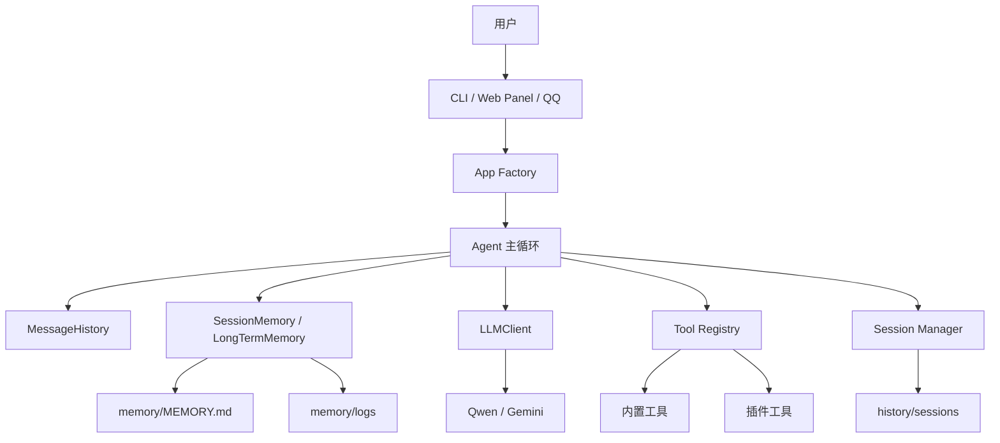
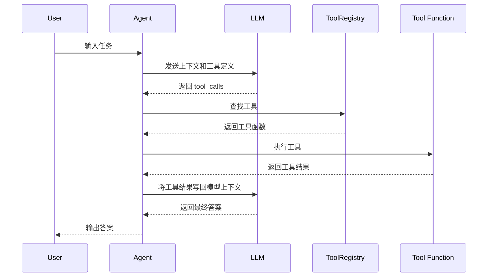

# Mini-OpenClaw

> 一个面向课程作业、本地实验和个人自动化探索的 Mini 智能体项目。  
> 项目实现了一个可运行、可扩展、可审计的本地 Agent 框架，支持多轮对话、工具调用、会话持久化、长期记忆、Web 面板、QQ OneBot 接入、插件扩展以及附件/多模态输入处理。

---

## 目录

- [1. 项目简介](#1-项目简介)
- [2. 项目目标](#2-项目目标)
- [3. 核心特性](#3-核心特性)
- [4. 功能概览](#4-功能概览)
- [5. 项目结构](#5-项目结构)
- [6. 系统架构与工作流程](#6-系统架构与工作流程)
- [7. 安装与环境准备](#7-安装与环境准备)
- [8. 配置说明](#8-配置说明)
- [9. 启动方式](#9-启动方式)
- [10. 使用说明](#10-使用说明)
- [11. 工具系统](#11-工具系统)
- [12. 附件与多模态输入](#12-附件与多模态输入)
- [13. 记忆与会话持久化](#13-记忆与会话持久化)
- [14. Web Panel](#14-web-panel)
- [15. QQ OneBot 接入](#15-qq-onebot-接入)
- [16. 插件开发](#16-插件开发)
- [17. 安全边界](#17-安全边界)
- [18. 测试](#18-测试)
- [19. 常见问题](#19-常见问题)
- [20. 后续扩展方向](#20-后续扩展方向)
- [21. 多 Agent 协作]()
- [新增功能](#新增功能)
- [22. 已知限制](#22-已知限制)
- [23. 适合阅读的核心文件](#23-适合阅读的核心文件)
- [24. 一句话总结](#24-一句话总结)


---

## 1. 项目简介

**Mini-OpenClaw** 是一个轻量级的本地智能体框架，适合用于课程设计、Agent 原理学习、本地自动化实验和插件式工具调用实践。

它不是一个完整的通用代理平台，而是把一个本地智能体的核心链路尽可能清晰地实现出来：

1. 用户通过 CLI、Web 或 QQ 输入问题；
2. 系统维护多轮对话上下文；
3. LLM 根据当前上下文理解任务；
4. 当模型需要外部能力时，通过 Function Calling 调用工具；
5. 工具执行结果被写回对话历史；
6. Agent 根据工具结果继续推理；
7. 输出最终答案；
8. 保存会话、工具调用记录与长期记忆。

项目重点是**可运行、可读、可改、可扩展**。相比只演示单轮问答的 Demo，本项目更强调 Agent 运行链路中的工程细节，例如工具注册、权限边界、会话恢复、附件处理、QQ 接入和插件加载。

---

## 2. 项目目标

本项目主要服务于以下目标：

### 2.1 学习型目标

- 理解 ReAct 风格 Agent 的基本工作流程；
- 理解 Function Calling 工具调用的完整链路；
- 理解多轮上下文如何被维护、裁剪和恢复；
- 理解长期记忆如何注入到 system prompt；
- 理解一个本地 Agent 如何接入文件系统、Shell、联网工具和第三方入口。

### 2.2 工程型目标

- 提供一个可以直接运行的本地 Agent 项目；
- 支持 CLI、Web Panel、QQ Bot 多入口；
- 支持常见文件和图片附件输入；
- 支持工具白名单、路径沙箱和基础网络访问限制；
- 支持插件式扩展，便于添加自定义工具；
- 保留完整会话、工具审计和每日对话日志，便于调试和复盘。

### 2.3 边界说明

Mini-OpenClaw 的目标不是替代成熟的 Agent 平台，也不是用于公网生产部署。它更适合作为：

- 课程作业；
- 毕设/课程项目原型；
- 本地 Agent 学习项目；
- 小型自动化实验框架；
- Function Calling 和工具系统实践项目。

---

## 3. 核心特性

| 模块 | 能力 |
| --- | --- |
| 对话能力 | 多轮对话、上下文裁剪、会话恢复 |
| Agent 循环 | ReAct 风格循环、Function Calling、工具结果回填 |
| 工具系统 | 工具注册表、工具白名单、插件工具加载 |
| 文件能力 | workspace 沙箱文件读写、目录操作、文本搜索 |
| Shell 能力 | 受限命令执行、PowerShell 实验扩展 |
| 联网能力 | 搜索网页、抓取网页正文、基础安全过滤 |
| Web Panel | 浏览器聊天、文件上传、图片上传、拍照上传、会话恢复 |
| 多模态输入 | 图片作为多模态消息发送，必要时切换视觉模型 |
| QQ 接入 | OneBot 私聊、群聊唤起、独立会话上下文 |
| 记忆系统 | 短期上下文裁剪、长期记忆文件、每日对话日志 |
| 审计能力 | 工具调用记录、会话记录、QQ 会话导出 |
| 扩展能力 | `plugins/` 目录动态加载插件工具 |

---

## 4. 功能概览

### 4.1 对话与推理

当前支持：

- 多轮对话；
- ReAct 风格循环；
- Function Calling；
- 工具调用审计；
- 会话保存与恢复；
- 长期记忆注入 system prompt；
- 每日对话日志落盘；
- 基于配置的模型提供商切换。

典型流程如下：

```text
用户输入
  ↓
写入 MessageHistory
  ↓
SessionMemory 裁剪上下文
  ↓
LLMClient 调用模型
  ↓
模型判断是否需要工具
  ├─ 是：执行工具 → 写回工具结果 → 继续推理
  └─ 否：输出最终答案
  ↓
保存会话与日志
```

### 4.2 支持的交互入口

项目提供三类入口：

1. **CLI 终端模式**  
   适合开发调试、课程演示和快速测试。

2. **Flask Web Panel**  
   适合浏览器交互、文件上传、图片上传和移动端拍照。

3. **QQ OneBot 模式**  
   适合将 Agent 接入 QQ 私聊或群聊场景。

### 4.3 Web Panel 附件能力

Web 面板当前支持：

- 纯文本提问；
- 上传普通文件；
- 上传图片；
- 手机浏览器直接拍照上传。

附件处理规则：

- 图片和拍照图片会按多模态图片消息发送给模型；
- 如果当前主模型不支持视觉输入，会自动切到视觉回退模型处理该轮请求；
- 常见文本文件会自动提取正文并拼入用户消息；
- 无法解析正文的文件会保留文件名、大小、MIME 等元信息，交由模型结合上下文回答。

当前自动解析的文件类型包括：

- `.txt`
- `.md`
- `.py`
- `.json`
- `.csv`
- `.yaml` / `.yml`
- `.html` / `.css` / `.js` / `.ts`
- `.xml`
- `.sql`
- `.log`
- `.pdf`
- `.docx`

暂不自动解析：

- 老式 `.doc` 文件；
- 二进制文件；
- 压缩包；
- 复杂多媒体文件。

### 4.4 已接入工具

默认启用工具见 [`config/tools_config.yaml`](config/tools_config.yaml)，当前包括：

- `read_file`
- `write_file`
- `list_directory`
- `create_directory`
- `delete_file`
- `get_current_time`
- `calculate`
- `manage_todo`
- `run_shell_command`
- `search_workspace_text`
- `count_text_lines`
- `count_words`
- `search_web`
- `fetch_webpage_text`
- `list_local_directory`
- `read_local_file`
- `run_powershell_command`

其中：

- `workspace` 文件工具是主工作流；
- 本地绝对路径访问和 PowerShell 是实验性扩展；
- 联网工具带有基础安全限制；
- 工具是否启用由配置文件统一控制。

### 4.5 模型提供商

当前代码支持：

- Qwen；
- Gemini。

在 Qwen 配置下，如果主模型是纯文本模型但消息中包含图片，会自动回退到视觉模型。当前默认回退配置是：

- `qwen-plus` 作为主模型；
- `qwen3.6-plus` 作为视觉回退模型。

---

## 5. 项目结构

```text
mini-openclaw/
├── core/                    # Agent 核心逻辑
│   ├── agent.py             # ReAct 主循环
│   ├── llm_client.py        # OpenAI 兼容接口封装
│   ├── attachments.py       # 附件解析与多模态消息组装
│   ├── message_history.py   # 消息历史
│   ├── tool_registry.py     # 工具注册表
│   ├── plugin_loader.py     # 插件加载
│   └── app_factory.py       # 应用装配
├── tools/                   # 内置工具
│   ├── file_tools.py        # workspace 文件工具
│   ├── shell_tools.py       # 受限 Shell 工具
│   ├── web_tools.py         # 联网搜索和网页抓取
│   └── ...
├── gateway/                 # 会话管理、QQ 接入
│   ├── session_manager.py   # 会话保存与恢复
│   ├── qq_bot.py            # QQ Bot 入口
│   ├── qq_client.py         # OneBot 客户端
│   └── qq_session_hub.py    # QQ 会话上下文管理
├── memory/                  # 长短期记忆
│   ├── session_memory.py    # 短期记忆裁剪
│   ├── long_term_memory.py  # 长期记忆读写
│   ├── MEMORY.md            # 长期记忆文件
│   └── logs/                # 每日对话日志
├── ui/                      # CLI 与 Web Panel
│   ├── cli.py
│   └── web_panel.py
├── plugins/                 # 自定义插件目录
│   └── example_plugin.py
├── history/                 # 会话持久化
│   ├── sessions/
│   └── qq_sessions/
├── workspace/               # 默认沙箱工作区
├── config/                  # 配置文件
│   ├── config.yaml
│   ├── tools_config.yaml
│   └── security_config.yaml
├── tests/                   # 测试
├── main.py                  # 启动入口
└── requirements.txt
```

---

## 6. 系统架构与工作流程

### 6.1 总体架构



### 6.2 Agent 主循环

核心在 [`core/agent.py`](core/agent.py)。

主流程如下：

1. 用户消息进入 `MessageHistory`；
2. `SessionMemory` 对上下文进行裁剪，控制历史长度；
3. `LongTermMemory` 将长期记忆注入 system prompt；
4. `LLMClient` 调用模型接口；
5. 如果模型返回 `tool_calls`：
   - Agent 逐个解析工具名和参数；
   - 在 `ToolRegistry` 中查找工具；
   - 执行工具；
   - 记录工具审计日志；
   - 将工具结果写回消息历史；
   - 进入下一轮模型调用；
6. 如果模型返回普通文本：
   - 视为最终答案；
   - 写入长期日志；
   - 返回给用户；
   - 根据入口类型决定是否保存或展示。

这是一个典型的“小型 ReAct + Function Calling”实现。

### 6.3 LLM 客户端

`LLMClient` 位于 [`core/llm_client.py`](core/llm_client.py)，主要负责：

- 读取模型提供商配置；
- 将内部消息格式转换为模型接口需要的格式；
- 提交对话请求；
- 解析模型返回的普通文本或工具调用；
- 在图片输入场景下处理视觉模型回退；
- 屏蔽不同模型提供商之间的调用差异。

### 6.4 应用装配

`app_factory.py` 负责把核心模块组装起来：

- 加载主配置；
- 初始化 LLM 客户端；
- 初始化工具注册表；
- 导入内置工具；
- 应用工具白名单；
- 加载插件；
- 初始化 Agent；
- 将 Agent 提供给 CLI、Web 或 QQ 入口使用。

---

## 7. 安装与环境准备

### 7.1 环境要求

建议环境：

- Python 3.11+
- Windows 或 Linux
- 能访问所选模型提供商接口
- 推荐使用虚拟环境隔离依赖

如果需要 PDF 正文抽取，需要安装 `pypdf`。当前 `requirements.txt` 已包含该依赖。

### 7.2 克隆项目

```powershell
git clone <your-repo-url>
cd mini-openclaw
```

如果你已经在本地拥有项目目录，可以直接进入项目根目录：

```powershell
cd D:\PythonAllWorkSpace\mini-openclaw
```

### 7.3 创建虚拟环境

Windows PowerShell：

```powershell
python -m venv .venv
.\.venv\Scripts\Activate.ps1
```

Linux / macOS：

```bash
python3 -m venv .venv
source .venv/bin/activate
```

### 7.4 安装依赖

```powershell
python -m pip install --upgrade pip
python -m pip install -r requirements.txt
```

### 7.5 配置环境变量

复制 `.env.example` 为 `.env`，然后填入你实际使用的 Key。

Windows PowerShell：

```powershell
Copy-Item .env.example .env
```

Linux / macOS：

```bash
cp .env.example .env
```

常见变量：

```env
DASHSCOPE_API_KEY=your_qwen_key
GEMINI_API_KEY=your_gemini_key
SERPAPI_API_KEY=optional
```

说明：

- `DASHSCOPE_API_KEY`：用于 Qwen 模型调用；
- `GEMINI_API_KEY`：用于 Gemini 模型调用；
- `SERPAPI_API_KEY`：可选，用于联网搜索能力；
- 如果不使用某个提供商，可以不配置对应 Key；
- 具体是否必填取决于 `config/config.yaml` 中选择的 provider。

---

## 8. 配置说明

主配置文件是 [`config/config.yaml`](config/config.yaml)。

### 8.1 LLM 配置

```yaml
llm:
  provider: "qwen"
  model: "qwen-plus"
  vision_fallback_model: "qwen3.6-plus"
  temperature: 0.3
  max_tokens: 2048
```

字段说明：

| 字段 | 说明 |
| --- | --- |
| `provider` | 模型提供商，例如 `qwen` 或 `gemini` |
| `model` | 默认主模型 |
| `vision_fallback_model` | 图片输入时使用的视觉回退模型 |
| `temperature` | 生成随机性，越低越稳定 |
| `max_tokens` | 单次回复最大 token 数 |

### 8.2 路径配置

```yaml
paths:
  workspace_dir: "workspace"
  history_dir: "history/sessions"
  qq_history_dir: "history/qq_sessions"
  memory_file: "memory/MEMORY.md"
  memory_logs_dir: "memory/logs"
  tool_audit_log: "logs/tool_audit.log"
```

字段说明：

| 字段 | 说明 |
| --- | --- |
| `workspace_dir` | 默认沙箱工作目录 |
| `history_dir` | CLI/Web 会话保存目录 |
| `qq_history_dir` | QQ 会话保存目录 |
| `memory_file` | 长期记忆文件 |
| `memory_logs_dir` | 每日对话日志目录 |
| `tool_audit_log` | 工具调用审计日志 |

### 8.3 Web 配置

```yaml
web:
  host: "127.0.0.1"
  port: 7860
  debug: false
  max_upload_bytes: 15728640
```

字段说明：

| 字段 | 说明 |
| --- | --- |
| `host` | Web 服务监听地址 |
| `port` | Web 服务端口 |
| `debug` | 是否开启 Flask debug |
| `max_upload_bytes` | 单个上传文件大小限制 |

### 8.4 QQ 配置

`qq:` 段用于控制 QQ OneBot 接入能力，包括：

- 是否启用 QQ 模式；
- OneBot 地址；
- 鉴权参数；
- 私聊/群聊触发方式；
- 输入长度限制；
- 输出长度限制；
- 冷却时间；
- 用户白名单/黑名单；
- 群白名单/黑名单；
- QQ 模式下启用的工具白名单。

### 8.5 工具配置

工具启用状态由 [`config/tools_config.yaml`](config/tools_config.yaml) 控制。

建议原则：

- 默认只启用课程演示必需工具；
- 涉及本地绝对路径、Shell、PowerShell 的工具应谨慎启用；
- QQ 模式建议使用更严格的工具白名单；
- 联网工具应配置域名限制，避免访问本机和内网资源。

### 8.6 安全配置

安全策略位于 [`config/security_config.yaml`](config/security_config.yaml)，主要包括：

- shell 命令白名单；
- 危险关键字拦截；
- 命令超时时间；
- 本地文件访问白名单目录；
- 联网访问域名白名单/黑名单；
- 私网地址拦截规则。

---

## 9. 启动方式

### 9.1 CLI 模式

```powershell
python main.py
```

启动后可以直接在终端输入问题：

```text
你：帮我列出 workspace 目录下的文件
```

恢复最近会话：

```powershell
python main.py --resume latest
```

恢复指定会话：

```powershell
python main.py --resume <session_id>
```

### 9.2 Web 模式

```powershell
python main.py --web
```

指定地址和端口：

```powershell
python main.py --web --host 127.0.0.1 --port 7860
```

启动后在浏览器访问：

```text
http://127.0.0.1:7860
```

Web 模式适合：

- 浏览器聊天；
- 上传文件；
- 上传图片；
- 手机浏览器拍照；
- 恢复历史会话；
- 展示更友好的交互界面。

### 9.3 QQ 模式

```powershell
python main.py --qq
```

前提：

1. `config/config.yaml` 中 `qq.enabled: true`；
2. OneBot 服务已经启动；
3. QQ 号、连接地址、鉴权信息配置正确；
4. 用户/群白名单策略符合预期。

---

## 10. 使用说明

### 10.1 CLI 命令

CLI 模式下支持：

| 命令 | 说明 |
| --- | --- |
| `/exit` | 退出并保存会话 |
| `/save` | 手动保存当前会话 |
| `/clear` | 清空当前会话上下文 |
| `/history` | 查看当前会话轮数 |
| `/remember <内容>` | 写入长期记忆 |
| `/list-sessions` | 列出历史会话 |
| `/help` | 查看帮助 |

示例：

```text
/remember 我正在开发 Mini-OpenClaw 项目，默认使用 Qwen 模型。
```

之后系统会在新的对话中尝试读取长期记忆，并把相关内容拼入 system prompt。

### 10.2 QQ 命令

QQ 模式下支持：

| 命令 | 说明 |
| --- | --- |
| `/help` | 查看 QQ 命令帮助 |
| `/reset` | 重置当前 QQ 会话上下文 |
| `/history` | 查看当前会话历史 |
| `/model` | 查看当前模型 |
| `/tools` | 查看可用工具 |
| `/export` | 导出 QQ 会话 |

此外，QQ 终端管理循环还支持：

| 命令 | 说明 |
| --- | --- |
| `/status` | 查看 QQ Bot 状态 |
| `/sessions` | 查看当前 QQ 会话 |
| `/ask <问题>` | 在终端向 Agent 提问 |
| `/send <QQ号> <消息>` | 向指定 QQ 私聊发送消息 |
| `/sendg <群号> <消息>` | 向指定 QQ 群发送消息 |

---

## 11. 工具系统

### 11.1 工具注册机制

工具通过 `@register_tool(...)` 注册到全局注册表。

核心文件：

- [`core/tool_registry.py`](core/tool_registry.py)
- [`tools/__init__.py`](tools/__init__.py)
- [`core/app_factory.py`](core/app_factory.py)

典型流程：

1. 工具模块被 import；
2. 工具函数通过装饰器注册；
3. 注册表保存工具名、描述、参数 schema 和执行函数；
4. 启动时根据 `tools_config.yaml` 过滤启用工具；
5. LLM 返回工具调用时，Agent 从注册表中查找并执行。

### 11.2 工具调用流程



### 11.3 内置工具分类

#### 文件工具

主要用于操作 `workspace/` 沙箱目录：

- 读取文件；
- 写入文件；
- 删除文件；
- 创建目录；
- 列出目录；
- 搜索 workspace 文本；
- 统计行数；
- 统计词数。

#### Shell 工具

用于执行受限命令：

- 按白名单允许命令；
- 阻止危险关键字；
- 设置执行超时；
- 记录工具审计日志。

#### 联网工具

用于轻量联网检索：

- 搜索网页；
- 抓取网页正文；
- 阻止访问 localhost、私网 IP 和受限域名。

#### 实验性本地工具

用于访问本机白名单目录：

- `list_local_directory`
- `read_local_file`
- `run_powershell_command`

这些工具不属于默认 workspace 沙箱，建议仅在明确需要时启用。

---

## 12. 附件与多模态输入

附件处理逻辑在 [`core/attachments.py`](core/attachments.py)。

### 12.1 上传保存路径

Web 上传文件默认保存到：

```text
workspace/uploads/<session_id>/
```

这样可以按会话隔离上传内容，便于后续查看和清理。

### 12.2 图片处理

图片处理流程：

1. 识别上传文件是否为图片；
2. 将图片保存到 uploads 目录；
3. 转换为 `image_url` data URL；
4. 作为多模态消息发送给兼容 OpenAI 的模型接口；
5. 如果当前主模型不支持视觉输入，则切换到视觉回退模型。

### 12.3 文本文件处理

文本类附件会自动抽取正文，并拼入用户消息中。这样用户可以直接上传 README、代码文件、配置文件或日志文件，然后让 Agent 分析、总结或修改。

### 12.4 PDF 与 DOCX 处理

- `.pdf`：通过 `pypdf` 抽取正文；
- `.docx`：通过读取 `word/document.xml` 抽取正文；
- `.doc`：老格式当前不做自动正文解析，会给出提示。

---

## 13. 记忆与会话持久化

### 13.1 短期记忆

短期记忆逻辑位于 [`memory/session_memory.py`](memory/session_memory.py)。

主要作用：

- 保留最近若干条消息；
- 控制上下文长度；
- 始终保留 system 消息；
- 避免长对话导致上下文无限增长。

### 13.2 长期记忆

长期记忆逻辑位于 [`memory/long_term_memory.py`](memory/long_term_memory.py)。

默认记忆文件：

```text
memory/MEMORY.md
```

长期记忆会在启动时读取，并拼入 system prompt，使模型在新会话中也能获取一些长期背景信息。

### 13.3 每日对话日志

每日对话日志默认写入：

```text
memory/logs/YYYY-MM-DD.md
```

用途包括：

- 复盘当天对话；
- 查找历史问题；
- 分析模型行为；
- 作为课程报告或实验记录素材。

### 13.4 会话持久化

会话逻辑在 [`gateway/session_manager.py`](gateway/session_manager.py)。

会保存：

- `session_id`
- 模型名
- 开始时间
- 结束时间
- 工具调用记录
- 全量消息历史

保存后可以通过以下方式恢复：

```powershell
python main.py --resume latest
python main.py --resume <session_id>
```

---

## 14. Web Panel

Web 界面在 [`ui/web_panel.py`](ui/web_panel.py)。

当前实现包含：

- 对话页面；
- 文件上传；
- 图片上传；
- 手机拍照上传；
- 发送前预览；
- 会话保存；
- 会话恢复；
- 上传文件访问路由；
- 简单 JSON API。

### 14.1 API 接口

目前暴露的接口包括：

| 方法 | 路径 | 说明 |
| --- | --- | --- |
| `GET` | `/api/sessions` | 获取历史会话列表 |
| `GET` | `/api/messages` | 获取当前或指定会话消息 |
| `GET` | `/uploads/<path>` | 访问上传文件 |

### 14.2 适用场景

Web Panel 适合用于：

- 课程展示；
- 演示多模态输入；
- 手机端拍照提问；
- 上传代码或文档让 Agent 分析；
- 展示会话恢复能力。

### 14.3 当前定位

当前 Web UI 是单文件 Flask 模板，强调简单、可读和易修改。它适合课程项目和小型 Demo，但不适合直接作为复杂前端工程的最终形态。

---

## 15. QQ OneBot 接入

QQ 模式实现位于：

- [`gateway/qq_bot.py`](gateway/qq_bot.py)
- [`gateway/qq_client.py`](gateway/qq_client.py)
- [`gateway/qq_session_hub.py`](gateway/qq_session_hub.py)

### 15.1 支持能力

当前支持：

- 私聊自动回复；
- 群聊按 `@` 或触发词唤起；
- 冷却时间控制；
- 用户白名单/黑名单；
- 群白名单/黑名单；
- QQ 会话独立上下文；
- QQ 会话导出；
- 终端手动下发 QQ 消息。

### 15.2 QQ 会话隔离

QQ 模式下，不同用户或不同群聊会拥有独立会话上下文，避免多人对话互相污染。

### 15.3 使用建议

由于 QQ 场景可能包含陌生人输入，建议：

- 启用用户或群白名单；
- 禁用高风险工具；
- 降低输出长度；
- 设置冷却时间；
- 对 QQ 模式使用单独的工具白名单；
- 不要直接开放本机敏感文件访问能力。

---

## 16. 插件开发

插件加载逻辑在 [`core/plugin_loader.py`](core/plugin_loader.py)。

### 16.1 插件加载规则

插件目录：

```text
plugins/
```

加载规则：

- 扫描 `plugins/*.py`；
- 跳过 `_` 开头的文件；
- 跳过 `__init__.py`；
- 动态 import；
- 插件内部通过 `register_tool` 暴露工具。

示例插件见：

```text
plugins/example_plugin.py
```

### 16.2 插件工具示例

下面是一个简单插件示例：

```python
from core.tool_registry import register_tool

@register_tool(
    name="hello_plugin",
    description="返回一个插件问候语",
    parameters={
        "type": "object",
        "properties": {
            "name": {
                "type": "string",
                "description": "要问候的名字"
            }
        },
        "required": ["name"]
    }
)
def hello_plugin(name: str) -> str:
    return f"你好，{name}！这是来自插件工具的问候。"
```

### 16.3 开发插件时的建议

- 工具名应简短、清晰、唯一；
- description 要说明工具适合什么场景；
- parameters schema 尽量明确；
- 工具内部应处理异常；
- 不要在插件中默认开放高风险系统能力；
- 对涉及文件、网络、命令执行的插件增加权限边界。

---

## 17. 安全边界

Mini-OpenClaw 不是完全开放式代理，默认设计是“本地可控 + 有边界的工具系统”。

### 17.1 workspace 沙箱

默认文件工具只允许操作 `workspace/` 目录内的内容。

例如 [`tools/file_tools.py`](tools/file_tools.py) 会对路径做 `resolve()` 检查，防止越界访问。

这样可以避免模型通过工具随意读取或修改项目外部文件。

### 17.2 受限 shell

[`tools/shell_tools.py`](tools/shell_tools.py) 只允许白名单命令，并且会拦截危险关键字。

默认允许的命令和超时策略在 [`config/security_config.yaml`](config/security_config.yaml) 中配置。

建议：

- 只允许课程演示需要的命令；
- 禁止删除、格式化、网络扫描等危险行为；
- 设置较短的命令执行超时；
- 记录所有 shell 工具调用。

### 17.3 联网工具限制

联网工具会阻止以下目标：

- `localhost`
- `127.0.0.1`
- `0.0.0.0`
- `::1`
- 私网 IP

并支持域名白名单/黑名单。

这个设计可以降低 SSRF 类风险，避免 Agent 通过联网工具访问本机服务或内网资源。

### 17.4 实验性本地文件访问

以下能力是实验性扩展：

- `list_local_directory`
- `read_local_file`
- `run_powershell_command`

这些能力不是 `workspace` 沙箱的一部分，而是“访问本机绝对路径”的额外能力，因此必须配置白名单目录。

建议只在本地受控环境中开启，并避免在 QQ 模式或公网环境中启用。

### 17.5 不建议公网暴露

本项目适合本地运行，不建议直接暴露到公网。尤其在启用以下能力时更应谨慎：

- Shell 工具；
- PowerShell 工具；
- 本地绝对路径访问；
- 文件写入；
- 联网抓取；
- QQ 群聊入口。

---

## 18. 测试

运行全部测试：

```powershell
python -m pytest -q
```

当前项目包含的测试覆盖：

- Agent 工具调用流程；
- 会话与记忆；
- Web 工具；
- 本地文件工具；
- PowerShell 工具；
- 附件解析；
- Web 上传链路；
- LLM 客户端图片回退逻辑。

建议在修改以下模块后运行测试：

- `core/agent.py`
- `core/llm_client.py`
- `core/attachments.py`
- `tools/`
- `gateway/session_manager.py`
- `ui/web_panel.py`
- `gateway/qq_bot.py`

---

## 19. 常见问题

### 19.1 为什么模型没有调用工具？

可能原因：

- 工具没有在 `tools_config.yaml` 中启用；
- 工具 description 不够明确；
- 当前模型没有正确返回 `tool_calls`；
- 用户问题不需要外部工具；
- 工具参数 schema 不符合模型调用格式。

排查建议：

1. 查看启动日志中工具是否成功加载；
2. 查看可用工具列表；
3. 检查模型响应是否包含 tool call；
4. 检查工具审计日志。

### 19.2 为什么上传图片后换了模型？

如果当前主模型不支持视觉输入，而用户上传了图片，系统会自动使用 `vision_fallback_model` 处理该轮请求。这是为了保证图片输入能够被模型理解。

### 19.3 为什么 `.doc` 文件不能解析？

`.doc` 是较旧的二进制格式，解析方式和 `.docx` 不同。当前项目仅对 `.docx` 做了自动正文解析，因此 `.doc` 会提示暂不支持自动解析。

### 19.4 为什么文件工具不能访问项目外文件？

默认文件工具受到 workspace 沙箱限制，只允许访问 `workspace/` 目录。这样可以避免模型误读或误写本机敏感文件。

如确实需要访问项目外路径，可以使用实验性本地文件工具，并在安全配置中设置白名单目录。

### 19.5 QQ 群聊里为什么没有回复？

可能原因：

- 没有 `@` Bot；
- 没有使用配置的触发词；
- 群不在白名单中；
- 用户在黑名单中；
- 冷却时间未结束；
- OneBot 服务未正确连接；
- QQ 模式没有启用。

---

## 20. 后续扩展方向

如果准备继续作为课程项目或个人项目推进，建议优先考虑以下方向：

### 20.1 流式输出

让 CLI 和 Web Panel 支持 token 级流式输出，提升交互体验。

### 20.2 更完善的工具权限系统

可以加入：

- 按入口区分工具权限；
- 按用户区分工具权限；
- 高风险工具二次确认；
- 工具调用频率限制；
- 工具执行前预览。

### 20.3 更强的附件解析

可以扩展：

- Excel 解析；
- PPTX 解析；
- 压缩包预览；
- OCR 图片文字识别；
- 更完善的 PDF 表格解析；
- 大文件分块摘要。

### 20.4 浏览器端异步聊天 UI

当前 Web UI 偏简单，可以继续改进为：

- 前后端分离；
- 消息流式渲染；
- 会话侧边栏；
- 文件预览；
- Markdown 渲染；
- 工具调用过程展示。

### 20.5 更稳定的联网检索

可以加入：

- 多搜索源；
- 网页正文清洗；
- 引用来源展示；
- 检索结果去重；
- 搜索结果缓存；
- RAG 检索流程。

### 20.6 多 Agent 协作

可以尝试拆分角色：

- 规划 Agent；
- 执行 Agent；
- 审查 Agent；
- 记忆 Agent；
- 工具调度 Agent。

### 20.7 任务计划器

可以加入定时任务能力，例如：

- 定时总结日志；
- 定时检查网页；
- 定时执行本地脚本；
- 定时发送 QQ 消息；
- 定时整理 workspace 文件。

### 20.8 结构化记忆检索

长期记忆可以从简单 Markdown 文件升级为：

- 向量库；
- SQLite；
- 标签化记忆；
- 按时间/主题检索；
- 自动总结重要事实。

---


## 21. 多 Agent 协作（主 Agent + 子 Agent）

Mini-OpenClaw 支持"主 Agent + 子 Agent"协作模式。主 Agent 可以通过 `delegate_task` 工具将特定任务委托给专门的子 Agent 执行，子 Agent 拥有独立的上下文和专用工具集。

### 21.1 架构概览

```text
用户输入
  ↓
主 Agent 判断任务
  ├─ 简单任务：直接处理
  └─ 专业任务：调用 delegate_task
        ↓
     子 Agent 启动（独立上下文 + 专用工具）
        ↓
     子 Agent 执行 ReAct 循环
        ↓
     结果返回主 Agent
  ↓
主 Agent 整合结果，输出最终答案
```

### 21.2 子 Agent 类型

默认预配置了三种子 Agent，定义在 `config/config.yaml` 的 `sub_agents.types` 中：

| 类型 | 说明 | 可用工具 |
| --- | --- | --- |
| `file_analyst` | 文件分析专家 | read_file, list_directory, search_workspace_text, count_text_lines |
| `web_researcher` | 网络调研专家 | search_web, fetch_webpage_text |
| `general` | 通用助手 | get_current_time, calculate, read_file, list_directory, manage_todo |

### 21.3 使用方式

无需特殊命令，直接用自然语言与主 Agent 对话即可。主 Agent 会根据任务性质自动判断是否需要委托子 Agent。

典型对话示例：

```text
你：帮我分析 workspace 里所有文件的结构和内容概要
```

主 Agent 识别到这是文件分析任务，自动委托给 `file_analyst` 子 Agent。

也可以更明确地指示：

```text
你：请用子Agent帮我搜索一下 Python 3.12 的新特性
```

### 21.4 运行时输出

子 Agent 的执行过程会在终端以紫色标记显示，与主 Agent 的输出区分：

```text
💭 Thought: 这个任务涉及大量文件分析，我委托给文件分析子Agent。
🔧 Action: delegate_task({"task": "分析workspace中的文件", "agent_type": "file_analyst"})
🤖 SubAgent [file_analyst] 启动: 分析workspace中的文件
  💭 [file_analyst] Thought: 先列出目录看看有哪些文件
  🔧 [file_analyst] Action: list_directory({})
  👁️ [file_analyst] Observation: [FILE] example.txt ...
🤖 SubAgent [file_analyst] 完成: 分析结果...
👁️ Observation: {"success": true, "content": "分析结果...", ...}
✅ Final Answer: 根据子Agent的分析结果...
```

### 21.5 子 Agent 配置

在 `config/config.yaml` 中可以调整子 Agent 行为：

```yaml
sub_agents:
  max_iterations: 5          # 子 Agent 最大推理轮数
  types:
    file_analyst:
      system_prompt: |        # 子 Agent 专属 system prompt
        你是一个专业的文件分析子 Agent...
      allowed_tools:           # 子 Agent 可用工具白名单
        - read_file
        - list_directory
        - search_workspace_text
        - count_text_lines
```

### 21.6 自定义子 Agent 类型

在 `sub_agents.types` 下添加新条目即可创建自定义子 Agent：

```yaml
sub_agents:
  types:
    code_reviewer:
      system_prompt: |
        你是一个代码审查子 Agent。你的职责是阅读代码文件并给出质量评估和改进建议。
        请使用中文回复。
      allowed_tools:
        - read_file
        - list_directory
        - search_workspace_text
```

添加后无需修改代码，主 Agent 即可通过 `delegate_task` 使用新类型。

### 21.7 关键设计要点

- **独立上下文**：每个子 Agent 拥有独立的 `MessageHistory`，不会污染主 Agent 的对话上下文；
- **工具隔离**：子 Agent 只能使用其配置中指定的工具，无法调用主 Agent 的全部工具；
- **共享模型**：子 Agent 复用主 Agent 的 LLM 客户端，无需额外配置 API Key；
- **迭代安全**：子 Agent 有独立的 `max_iterations` 限制，防止无限循环；
- **审计完整**：子 Agent 的工具调用同样会被记录到工具审计日志中。

### 21.8 相关文件

| 文件 | 说明 |
| --- | --- |
| [`core/sub_agent.py`](core/sub_agent.py) | 子 Agent 核心实现 |
| [`core/agent.py`](core/agent.py) | 主 Agent，包含 `delegate_to_sub_agent` 方法 |
| [`tools/sub_agent_tools.py`](tools/sub_agent_tools.py) | `delegate_task` 工具注册 |
| [`gateway/output_handler.py`](gateway/output_handler.py) | 子 Agent 输出格式 |
| [`config/config.yaml`](config/config.yaml) | 子 Agent 类型与工具配置 |
Agent 调用流程（含子 Agent）

  以用户输入 "帮我分析 workspace 里的文件结构" 为例，完整流程如下：

  用户: "帮我分析 workspace 里的文件结构"
  │
  │  ① handle_user_message()
  │
  ├─ 写入 MessageHistory
  ├─ SessionMemory.trim_messages() 裁剪上下文
  ├─ LLMClient.create_chat_completion(messages, tools)
  │      ↓
  │  模型返回 tool_calls: [{ name: "delegate_task", arguments: {
  │      "task": "分析workspace文件结构", "agent_type": "file_analyst"
  │  }}]
  │
  ├─ ② Agent 解析 tool_call，在 TOOL_REGISTRY 中找到 delegate_task 函数
  ├─ ③ TOOL_REGISTRY.call_tool("delegate_task", {...})
  │      ↓
  │  delegate_task() 函数内部调用 _agent_ref.delegate_to_sub_agent()
  │      ↓
  │  ④ Agent.delegate_to_sub_agent() 执行：
  │      │
  │      ├─ 从 config.yaml 读取 file_analyst 的配置
  │      │    system_prompt: "你是文件分析子Agent..."
  │      │    allowed_tools: [read_file, list_directory, ...]
  │      │
  │      ├─ 创建 SubAgent 实例（独立 MessageHistory，共享 LLMClient）
  │      │
  │      └─ ⑤ SubAgent.run("分析workspace文件结构")
  │           │
  │           │  ── 子 Agent 自己的 ReAct 循环 ──
  │           │
  │           ├─ LLM 返回 tool_call: list_directory({})
  │           ├─ 执行 list_directory → 得到文件列表
  │           ├─ LLM 返回 tool_call: read_file({"path": "example.txt"})
  │           ├─ 执行 read_file → 得到文件内容
  │           ├─ LLM 返回纯文本: "workspace 包含3个文件..."
  │           │
  │           └─ return "workspace 包含3个文件..."
  │
  ├─ ⑥ delegate_task 返回 {"success": True, "content": "workspace 包含3个文件..."}
  ├─ 工具结果写回主 Agent 的 MessageHistory
  ├─ 主 Agent 再次调用 LLM，LLM 看到子 Agent 的分析结果
  ├─ LLM 返回纯文本最终答案
  │
  └─ ⑦ 输出给用户: "根据分析，workspace 目录下有..."

  核心要点总结

  ┌────────────────────────┬─────────────────────────────────────────────────────────────────────────────┐
  │          概念          │                                    机制                                     │
  ├────────────────────────┼─────────────────────────────────────────────────────────────────────────────┤
  │ 工具如何注册           │ @register_tool 装饰器 → import 时自动执行 → 存入全局 TOOL_REGISTRY          │
  ├────────────────────────┼─────────────────────────────────────────────────────────────────────────────┤
  │ 工具如何过滤           │ tools_config.yaml 白名单 → enable_only()                                    │
  ├────────────────────────┼─────────────────────────────────────────────────────────────────────────────┤
  │ LLM 如何知道有哪些工具 │ get_openai_tool_schemas() 生成 JSON schema 传给模型                         │
  ├────────────────────────┼─────────────────────────────────────────────────────────────────────────────┤
  │ LLM 如何调用工具       │ 模型返回 tool_calls → Agent 解析 → TOOL_REGISTRY.call_tool()                │
  ├────────────────────────┼─────────────────────────────────────────────────────────────────────────────┤
  │ 子 Agent 如何触发      │ delegate_task 本身就是一个普通工具，LLM 像调用其他工具一样调用它            │
  ├────────────────────────┼─────────────────────────────────────────────────────────────────────────────┤
  │ 子 Agent 如何隔离      │ 独立 MessageHistory，独立工具白名单，独立 max_iterations                    │
  ├────────────────────────┼─────────────────────────────────────────────────────────────────────────────┤
  │ 子 Agent 如何复用能力  │ 共享同一个 LLMClient（同 API Key、同模型）和同一个 TOOL_REGISTRY            │
  ├────────────────────────┼─────────────────────────────────────────────────────────────────────────────┤
  │ 结果如何回传           │ 子 Agent 的最终文本 → 作为 delegate_task 工具的返回值 → 写回主 Agent 上下文 │
  └────────────────────────┴─────────────────────────────────────────────────────────────────────────────┘

  所以从 LLM 的视角看，delegate_task 和 read_file 没有任何区别 — 都是一个工具调用，只不过 delegate_task
  内部启动了一个完整的子 ReAct 循环。这就是"主 Agent + 子 Agent"协作的核心设计思路。

---

## 新增功能

### 流式输出

CLI 和 Web 面板均已支持 token 级流式输出。

- **CLI**：`main.py` 中的 `_run_streaming()` 使用 `handle_user_message_stream()` 生成器，逐 token 实时打印 AI 回复，工具调用和观察结果也会实时显示。
- **Web**：通过 SSE（Server-Sent Events）将流式事件推送到前端，浏览器逐 token 渲染 AI 回复。

### 任务计划器

新增 `tools/scheduler_tools.py`，提供简单定时执行能力：

| 工具 | 说明 |
| --- | --- |
| `schedule_task` | 延迟 1-86400 秒后执行 Shell 命令 |
| `list_scheduled_tasks` | 查看所有已调度任务及状态 |
| `cancel_scheduled_task` | 取消待执行的任务 |

### Web Panel 增强

#### 会话侧边栏

左侧暗色侧边栏展示历史会话列表，支持一键切换、新建对话、保存会话。

#### Markdown 渲染与代码高亮

AI 回复使用 marked.js 渲染 Markdown，代码块使用 highlight.js 语法高亮。

#### 文件预览

上传文件前可预览缩略图和文件信息，点击附件可在模态框中查看大图或高亮代码。

#### AI 图片生成

Web 面板输入框旁新增 🎨 按钮，点击后弹出图片生成面板，可以：

1. 输入描述文字
2. 选择图片尺寸（方形 / 竖版 / 横版）
3. 点击生成，图片保存到 `workspace/generated/`

图片生成使用通义万相 `wanx2.1-t2i-turbo` 模型，通过 DashScope OpenAI 兼容接口调用。前提条件：`.env` 中配置 `DASHSCOPE_API_KEY`。

也可以在聊天中直接让 Agent 生成图片：

```text
你：帮我生成一张图片：一只橘色小猫坐在窗台上
```

相关文件：[`tools/image_gen_tools.py`](tools/image_gen_tools.py)、[`ui/web_panel.py`](ui/web_panel.py)

#### 文件生成

Agent 可使用 `generate_file` 工具生成任意文件（代码、配置、文档等），保存到 `workspace/generated/`。

#### 工具市场 / 插件管理

侧边栏底部「🔧 工具」按钮可打开插件管理面板，查看所有已注册工具，实时启用/禁用，重新加载插件。

---

## 22. 已知限制

当前已知限制包括：

- `.doc` 老格式当前不自动解析；
- QQ 入口当前主要处理文本，不处理复杂多媒体消息链；
- Web UI 是单文件 Flask 模板，适合课程项目，不适合复杂前端工程；
- 工具权限控制已有基础边界，但仍然是本地实验项目，不应直接暴露到公网高风险环境；
- 联网工具不是搜索引擎级检索系统，更偏演示和轻量使用；
- 长期记忆目前是 Markdown 文件形式，缺少结构化检索；
- 工具调用依赖模型的 Function Calling 能力，模型表现会影响工具使用稳定性；
- 大文件解析和超长上下文处理仍有优化空间。

---

## 23. 适合阅读的核心文件

如果你要继续开发，建议优先看这些文件：

- [`main.py`](main.py)
- [`core/agent.py`](core/agent.py)
- [`core/llm_client.py`](core/llm_client.py)
- [`core/attachments.py`](core/attachments.py)
- [`core/app_factory.py`](core/app_factory.py)
- [`core/tool_registry.py`](core/tool_registry.py)
- [`memory/session_memory.py`](memory/session_memory.py)
- [`memory/long_term_memory.py`](memory/long_term_memory.py)
- [`gateway/session_manager.py`](gateway/session_manager.py)
- [`ui/web_panel.py`](ui/web_panel.py)
- [`gateway/qq_bot.py`](gateway/qq_bot.py)
- [`config/config.yaml`](config/config.yaml)
- [`config/tools_config.yaml`](config/tools_config.yaml)
- [`config/security_config.yaml`](config/security_config.yaml)

推荐阅读顺序：

1. `main.py`：理解启动入口；
2. `core/app_factory.py`：理解对象如何装配；
3. `core/agent.py`：理解 Agent 主循环；
4. `core/tool_registry.py`：理解工具注册；
5. `tools/`：理解具体工具实现；
6. `memory/`：理解记忆系统；
7. `gateway/session_manager.py`：理解会话保存；
8. `ui/web_panel.py` 或 `gateway/qq_bot.py`：理解不同入口如何复用 Agent。

---

## 24. 一句话总结

**Mini-OpenClaw 是一个本地可运行、带工具调用、带记忆、带 Web/QQ 入口、支持附件与多模态输入，并具有基础安全边界和插件扩展能力的课程型 Mini Agent 实现。**

---
